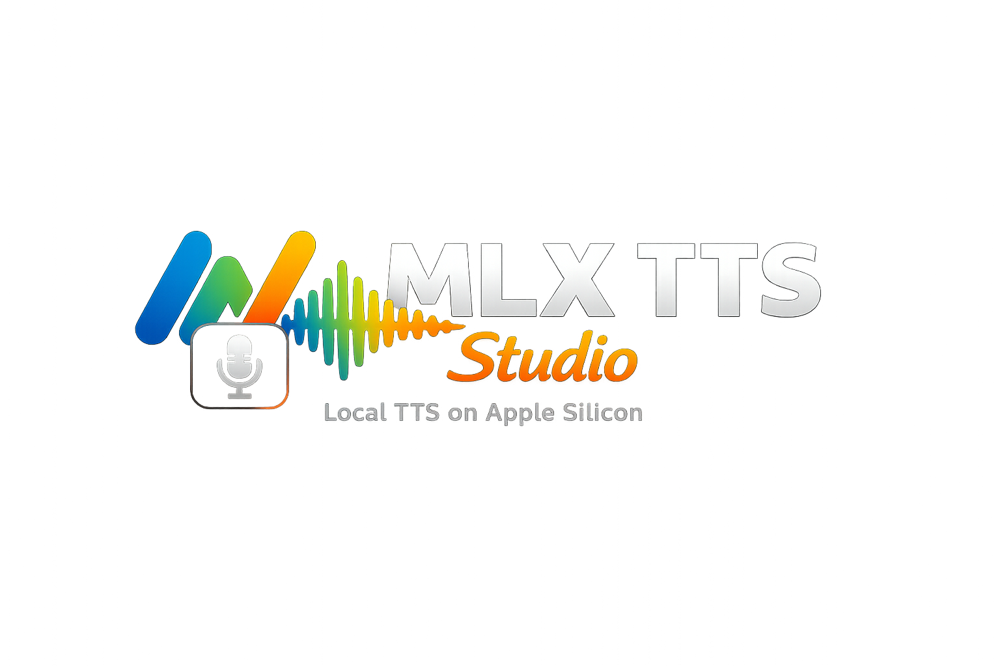

<p align="center">
  
</p>

<p align="center">
  Local multi-engine TTS studio for Apple Silicon.<br>
  Qwen3-TTS, Kokoro, and Dia in one browser UI. No cloud. No API keys.
</p>

<p align="center">
  
  
  
  
  
</p>

---

## Quick Start

```bash
git clone https://github.com/ch1ppyone/mlx-tts-studio.git
cd mlx-tts-studio
bash install.sh
./run.sh
```

Open `http://localhost:7860` if the browser does not open on its own.

### First run

1. `install.sh` creates a virtual environment and installs dependencies.
2. `run.sh` starts the FastAPI server and opens the UI.
3. The first generation downloads model weights from Hugging Face.
4. Later runs reuse the local cache.

### Re-run later

```bash
./run.sh
```

Stop the server with `Ctrl+C`.

---

## What You Get

- Local-only TTS for Apple Silicon
- Three engines in one UI: `Qwen3-TTS`, `Kokoro`, `Dia`
- Reference library with upload, rename, delete, and preview
- Safe reference preprocessing with quality warnings
- Per-model history and per-model active result player
- Session-scoped text drafts for each engine
- English, Russian, and Chinese UI
- Voice preview, waveform playback, cache status, Finder integration

---

## Engines

| Engine | Best for | Voices | Languages | Clone support | Notes |
|---|---|---:|---|---|---|
| `Qwen3-TTS` | Studio output, multilingual work, voice design | 9 presets | 10+ | Yes | Supports cloning, instruct, emotions |
| `Kokoro` | Fast preset voice generation | 50+ | 9 | No | Very light and fast |
| `Dia` | Two-speaker dialogue | 0 presets | English | Shared prompt only | Supports dialogue editor and stage cues |

### Best engine for…

- **Cloning and multilingual output** → Qwen3-TTS
- **Fastest preset voices** → Kokoro
- **Two-speaker dialogue** → Dia

### Qwen3-TTS

Use it for normal TTS, voice cloning, and text-based voice design.

### Kokoro

Use it when you want speed, preset voices, and low memory use.

### Dia

Use it for two-speaker dialogue with `[S1]` and `[S2]`.

Important: `Dia` does not provide true independent cloning for `S1` and `S2`. The app uses one shared reference audio plus optional reference text as a style prompt for the whole dialogue.

Strong cues such as `(singing)` or `(humming)` can spill into later lines, swallow words, or add musical artifacts.

---

## Demo

<p align="center">
  
</p>

---

## Main Features

| Feature | Details |
|---|---|
| Multi-engine UI | One interface for `Qwen3-TTS`, `Kokoro`, and `Dia` |
| Capability-driven rendering | Frontend adapts to each engine automatically |
| Reference cloning | Upload `WAV`, `MP3`, or `M4A` reference audio |
| Reference preprocessing | Mono, resample, trim silence, normalize, optional denoise/high-pass |
| Reference library | Persistent local library with rename, delete, and preview |
| Dialogue editor | Visual Dia editor with stage cue dropdowns |
| Voice preview | Preview selected voices before generation |
| Per-model history | Each `engine + model` pair keeps its own visible history |
| Per-model result player | Switching model restores that model's last result player |
| Session drafts | Each engine keeps its own draft during the session; drafts reset on reload |
| Finder integration | Open the cached model folder from the UI |
| Trilingual UI | English, Russian, Chinese |
| Docker support | `Dockerfile`, `docker-compose`, healthcheck |

---

## Reference Audio Workflow

The app preprocesses reference audio locally before cloning.

Default preprocessing:

- convert to mono
- resample to the target rate
- trim silence at the edges
- normalize volume

Optional toggles:

- light denoise
- high-pass cleanup

Quality checks report:

- clip too short or too long
- low volume
- clipping risk
- stereo input
- too much silence
- elevated noise floor

Best results usually come from `5-15s` of clean single-speaker speech.

---

## History, Drafts, and Playback

- History is stored in `localStorage`
- The visible history is scoped to the current `engine + model`
- `Clear history` clears only the current model scope
- The active result player is also scoped to the current `engine + model`
- Text drafts are kept separately for each engine during the current browser session
- Reloading the page clears those drafts on purpose

---

## Requirements

- macOS on Apple Silicon
- Python `3.10+`
- Xcode Command Line Tools
- `ffmpeg` and `ffprobe` recommended for full reference preprocessing quality

Install Python if needed:

```bash
brew install python@3.11
```

Optional Kokoro dependency during install:

```bash
MLX_TTS_INSTALL_ESPEAK=1 bash install.sh
```

---

## Native macOS recommended

Running natively on Apple Silicon gives full MLX acceleration and the best generation speed. Docker works but runs noticeably slower because Metal GPU access is not available inside the container.

---

## Docker

```bash
docker compose up --build
```

The compose file persists the Hugging Face model cache in a Docker volume.

Useful override:

```bash
MLX_TTS_PORT=8080 docker compose up --build
```

Docker on macOS uses CPU fallback. Native macOS launch is the fast path.

---

## Cache and Storage

Model cache:

```text
~/.cache/huggingface/hub/
```

Reference library:

```text
~/.mlx-tts-studio/refs
```

The System Info panel shows loaded model state, cache status, app URL, and counts.

---

## Project Layout

```text
mlx-tts-studio/
├── app/
│   ├── app.py
│   ├── audio_preprocess.py
│   ├── config.py
│   ├── engines.py
│   ├── index.html
│   └── static/
│       ├── dia.js
│       ├── engine-ui.js
│       ├── generate.js
│       ├── help.js
│       ├── history.js
│       ├── i18n.js
│       ├── main.js
│       ├── preview.js
│       ├── settings.js
│       ├── state.js
│       ├── status.js
│       ├── style.css
│       ├── terminal.js
│       └── waveform.js
├── Dockerfile
├── docker-compose.yml
├── install.sh
├── run.sh
└── README.md
```

The engine registry in `app/engines.py` drives the frontend. Each engine declares capabilities, and the UI builds itself from that registry.

---

## Configuration

| Variable | Default | Description |
|---|---|---|
| `MLX_TTS_HOST` | `0.0.0.0` | Bind address |
| `MLX_TTS_PORT` | `7860` | Server port |
| `MLX_TTS_PORT_RANGE` | `10` | Port scan range |
| `MLX_TTS_AUDIO_TTL` | `7200` | In-memory audio lifetime in seconds |
| `MLX_TTS_MAX_AUDIO` | `200` | Max generated audio blobs kept in memory |
| `MLX_TTS_PREVIEW_TEXT` | `Hello! This is a preview of how I sound.` | Preview text |
| `MLX_TTS_TEMP_DIR` | system default | Temp directory |
| `MLX_TTS_REF_DIR` | `~/.mlx-tts-studio/refs` | Reference library path |
| `MLX_TTS_NO_BROWSER` | unset | Set to `1` to disable auto-open |
| `MLX_TTS_INSTALL_ESPEAK` | unset | Set to `1` during install for `espeak-ng` |

See `.env.example` for a minimal template.

---

## API

| Method | Endpoint | Purpose |
|---|---|---|
| `GET` | `/api/health` | Healthcheck |
| `GET` | `/api/config` | Engine registry and params |
| `GET` | `/api/status` | Loaded model, system info, counts |
| `GET` | `/api/cache-status` | Model cache state |
| `POST` | `/api/cache-open` | Open cached model in Finder |
| `POST` | `/api/upload-ref` | Upload reference audio |
| `GET` | `/api/ref/list` | List reference library |
| `GET` | `/api/ref/{id}/meta` | Get reference metadata |
| `POST` | `/api/ref/{id}/preprocess` | Reprocess reference |
| `POST` | `/api/ref/{id}/rename` | Rename reference |
| `GET` | `/api/ref/{id}/audio` | Stream original or processed reference |
| `DELETE` | `/api/ref/{id}` | Delete reference |
| `POST` | `/api/preview` | Preview selected voice |
| `POST` | `/api/cancel` | Cancel generation |
| `POST` | `/api/generate` | Main SSE generation endpoint |
| `GET` | `/api/audio/{id}` | Download generated WAV |
| `HEAD` | `/api/audio/{id}` | Check whether generated audio still exists |

### SSE states

- `downloading`
- `loading`
- `generating`
- `done`
- `error`
- `cancelled`

---

## Limitations

- First run downloads are large
- Only one generation runs at a time
- No streaming playback during generation
- `Dia` is English-only
- `Dia` cloning is shared-prompt guidance, not per-speaker cloning
- Voice design remains experimental
- Docker on macOS is slower than native launch

---

## Tech Stack

- Backend: [FastAPI](https://fastapi.tiangolo.com/) + [Uvicorn](https://www.uvicorn.org/)
- Runtime: [MLX](https://github.com/ml-explore/mlx) via [mlx-audio](https://github.com/lucasnewman/mlx-audio)
- Models: [Qwen3-TTS](https://huggingface.co/collections/mlx-community/qwen3-tts-12hz-685b6b6d1a30db10067f70f0), [Kokoro](https://huggingface.co/mlx-community/Kokoro-82M-bf16), [Dia](https://huggingface.co/mlx-community/Dia-1.6B)
- Frontend: vanilla ES modules
- Transport: Server-Sent Events
- Audio UI: Web Audio API + Canvas

---

## License

This project uses the [MIT License](LICENSE).

The bundled model integrations point to external model repositories. Check each model license before commercial use.

---

<p align="center">Made with ❤️ by <a href="https://github.com/ch1ppyone">ch1ppyone</a></p>
