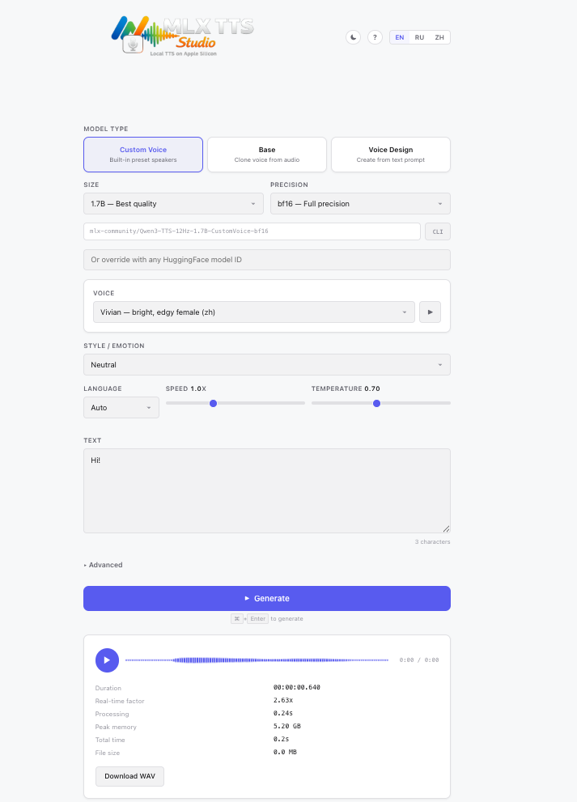

<p align="center">
  
</p>

<p align="center">
  Local TTS UI for Qwen3-TTS on Apple Silicon.<br>
  Clone, design, and generate voices with zero cloud.
</p>

<p align="center">
  <sub>Created by <strong>ch1ppyone</strong></sub>
</p>

<p align="center">
  
  
  
  
</p>

---

## Demo

<p align="center">
  
</p>

---

## Use Cases

- **Voiceover production** — narrate videos, podcasts, or presentations without hiring a voice actor
- **Game development** — generate NPC dialogue lines in multiple voices and emotions
- **Content creation** — produce audio versions of blog posts, newsletters, or documentation
- **Accessibility** — convert text to speech for visually impaired users or reading assistance
- **Prototyping** — quickly test how text sounds before recording with a real voice
- **Localization** — generate multilingual speech drafts across 10+ languages

---

## Why

Most TTS solutions require cloud APIs, send your text to third-party servers, or are painful to set up locally. If you own an Apple Silicon Mac, you already have a powerful ML accelerator sitting idle.

This project gives you a **one-command install** and a polished web UI that runs entirely on your hardware — no accounts, no API keys, no internet required after the initial model download. You get real-time voice synthesis with full control over model type, voice, emotion, and quality.

---

## Features

| Feature | Description |
|---|---|
| **Model Selector** | Pick model type, size, and quantization from dropdowns — model ID is composed automatically |
| **9 Preset Voices** | Vivian, Serena, Ryan, Aiden, and more — with a **preview button** to hear each one |
| **Voice Cloning** | Upload reference audio to clone any voice (Base model type) |
| **Voice Design** | Describe a voice in natural language and the model creates it |
| **Emotion Presets** | One-click style presets: Happy, Sad, Calm, Whisper, News Anchor, Storytelling, etc. |
| **Waveform Player** | Custom canvas-based audio player with seek, waveform visualization, and time display |
| **Generation History** | Scrollable list of past results with audio player, repeat button, and delete |
| **Drag & Drop** | Drop `.txt` or `.srt` files into the text area — subtitles are auto-cleaned |
| **Copy CLI Command** | One click copies the equivalent `python -m mlx_audio.tts.generate ...` command |
| **Download Progress** | Real-time progress bar when downloading model weights from Hugging Face |
| **Estimated Time** | Shows `~N sec` before generation starts, calibrated from your actual hardware RTF |
| **Cancellation** | Cancel button to abort model downloads or long generations mid-flight |
| **Light & Dark Theme** | Clean light theme by default, dark theme toggle in the header — preference saved |
| **Trilingual UI** | Full English / Russian / Chinese interface with a toggle in the header |
| **Advanced Controls** | Top P, Top K, Repetition Penalty, Temperature, Speed, Max Tokens |
| **Keyboard Shortcut** | `Cmd+Enter` to generate instantly |

---

## Example Output

> Generated with **Qwen3-TTS 1.7B bf16**, voice **Vivian**, default settings on M4 Max.

| Parameter | Value |
|---|---|
| Text | "Hello! This is a demonstration of local text-to-speech synthesis on Apple Silicon." |
| Processing time | 1.3 s |
| Real-time factor | 0.31x (3x faster than real-time) |
| Audio duration | 4.2 s |
| Peak memory | 4.12 GB |

### Audio Sample

> **Hear it yourself** — [listen to sample.wav](assets/sample.wav)

---

## Quick Start

### Requirements

- **macOS** on Apple Silicon (M1 / M2 / M3 / M4, any tier)
- **Python 3.10+** (ships with macOS or install via `brew install python@3.11`)
- **Xcode Command Line Tools** (`xcode-select --install`)

### Install

```bash
git clone https://github.com/ch1ppyone/mlx-tts-studio.git
cd mlx-tts-studio
bash install.sh
```

### What `install.sh` does

No magic — here is every step, in order:

| Step | What happens |
|---|---|
| 1 | Checks that you're on macOS with Xcode CLI tools |
| 2 | Verifies Python 3.10+ is available |
| 3 | Creates a `.venv` virtual environment in the project root |
| 4 | Upgrades pip and installs dependencies from `requirements.txt` |
| 5 | Verifies `import mlx_audio` works |
| 6 | Generates `run.sh` (the launch script) and makes it executable |

Dependencies installed: `fastapi`, `uvicorn`, `python-multipart`, `mlx-audio` (which pulls in `mlx`, `transformers`, `huggingface-hub`, etc.)

Nothing is installed globally. Everything lives inside `.venv`. Delete the folder to uninstall.

### Run

```bash
./run.sh
```

The server auto-picks a free port (default **7860**) and prints the URL in the terminal. If 7860 is busy, it tries 7861, 7862, and so on.

> The first generation will download model weights from Hugging Face (~1–3 GB depending on quantization). Progress is shown in the UI.

---

## Performance

Benchmarked on **M4 Max (48 GB)** with **Qwen3-TTS 1.7B bf16 (CustomVoice)**:

| Metric | Value |
|---|---|
| Real-time factor (RTF) | ~0.3x (generates 3x faster than playback) |
| Time per sentence | ~1–3 sec for typical sentences |
| Peak memory | ~4.1 GB |
| Model load (first run) | ~5–10 sec (from disk cache) |
| Model load (cached) | Instant |

Smaller models and quantized variants are faster:

| Config | RTF | Peak Memory |
|---|---|---|
| 1.7B bf16 | ~0.3x | ~4.1 GB |
| 1.7B 8-bit | ~0.25x | ~2.5 GB |
| 1.7B 4-bit | ~0.2x | ~1.5 GB |
| 0.6B bf16 | ~0.15x | ~1.8 GB |
| 0.6B 8-bit | ~0.12x | ~1.0 GB |

> RTF < 1.0 means faster than real-time. Lower is better.

---

## Qwen3-TTS Model Guide

Every model ID follows the pattern:

```
mlx-community/Qwen3-TTS-12Hz-{size}-{type}-{quant}
```

### Model Types

| Type | Use Case | Required Input |
|---|---|---|
| **Base** | Clone any voice from an audio sample | `ref_audio` + optional `ref_text` |
| **CustomVoice** | Use built-in preset speakers (Vivian, Ryan, etc.) | `voice` name |
| **VoiceDesign** | Create a new voice from a text description | `instruct` prompt |

### Model Sizes

| Size | Parameters | Notes |
|---|---|---|
| **0.6B** | 600M | Lighter, faster, lower quality ceiling. Available for Base and CustomVoice. |
| **1.7B** | 1.7B | Best quality. Available for all three types. Recommended for M-series Pro/Max/Ultra. |

### Quantization

| Precision | Approx. Size (1.7B) | Quality | Memory |
|---|---|---|---|
| **bf16** | ~3.4 GB | Best | Highest |
| **8-bit** | ~1.7 GB | Near-lossless | Moderate |
| **6-bit** | ~1.3 GB | Good | Lower |
| **5-bit** | ~1.1 GB | Acceptable | Lower |
| **4-bit** | ~0.9 GB | May lose nuance | Lowest |

### Preset Voices (CustomVoice)

| Voice | Description | Native Language |
|---|---|---|
| Vivian | Bright, slightly edgy young female | Chinese |
| Serena | Warm, gentle young female | Chinese |
| Uncle Fu | Seasoned male, low mellow timbre | Chinese |
| Dylan | Youthful Beijing male, clear and natural | Chinese (Beijing) |
| Eric | Lively Chengdu male, slightly husky | Chinese (Sichuan) |
| Ryan | Dynamic male with strong rhythmic drive | English |
| Aiden | Sunny American male with clear midrange | English |
| Ono Anna | Playful female, light and nimble | Japanese |
| Sohee | Warm female with rich emotion | Korean |

> All voices work with any text language — the native language indicates the voice's origin and accent characteristics.

---

## Recommended Models by Hardware

| Mac | Recommended Config | Model ID |
|---|---|---|
| M1 / M2 (8 GB) | 0.6B + 8-bit | `mlx-community/Qwen3-TTS-12Hz-0.6B-CustomVoice-8bit` |
| M1 Pro / M2 Pro (16 GB) | 1.7B + 8-bit | `mlx-community/Qwen3-TTS-12Hz-1.7B-CustomVoice-8bit` |
| M1 Max / M2 Max (32 GB) | 1.7B + bf16 | `mlx-community/Qwen3-TTS-12Hz-1.7B-CustomVoice-bf16` |
| M3 Pro / M4 Pro (24+ GB) | 1.7B + bf16 | `mlx-community/Qwen3-TTS-12Hz-1.7B-CustomVoice-bf16` |
| M3 Max / M4 Max (48+ GB) | 1.7B + bf16 | `mlx-community/Qwen3-TTS-12Hz-1.7B-CustomVoice-bf16` |

> These are starting points. You can always override the model ID in the UI with any compatible Hugging Face repo.

---

## Supported Languages

Qwen3-TTS supports multilingual synthesis. The web UI includes a language selector with:

| Code | Language |
|---|---|
| `auto` | Auto-detect |
| `en` | English |
| `zh` | Chinese |
| `ja` | Japanese |
| `ko` | Korean |
| `ru` | Russian |
| `es` | Spanish |
| `fr` | French |
| `de` | German |
| `pt` | Portuguese |
| `ar` | Arabic |

---

## Project Structure

```
mlx-tts-studio/
├── app/
│   ├── app.py          # FastAPI backend (model loading, generation, SSE streaming)
│   ├── index.html      # Single-file frontend (HTML + CSS + JS, no build step)
│   └── logo.png        # Project logo
├── assets/
│   ├── demo.png        # UI screenshot for README
│   └── sample.wav      # Example audio output
├── install.sh          # One-time setup: venv, deps, generates run.sh
├── run.sh              # Generated by install.sh — starts the server
├── requirements.txt    # Python dependencies
└── README.md
```

---

## API Reference

All endpoints are served from the auto-selected port (default `http://localhost:7860`).

| Method | Endpoint | Description |
|---|---|---|
| `GET` | `/` | Serves the web UI |
| `GET` | `/api/config` | Returns model configuration (types, sizes, quants) |
| `GET` | `/api/status` | Returns currently loaded model name |
| `POST` | `/api/generate` | Main TTS endpoint — returns SSE stream with progress events |
| `POST` | `/api/preview` | Generate a short voice preview (cached after first call) |
| `POST` | `/api/cancel` | Cancel an in-progress generation or download |
| `POST` | `/api/upload-ref` | Upload reference audio for voice cloning (multipart) |
| `DELETE` | `/api/ref/{id}` | Delete an uploaded reference audio file |
| `GET` | `/api/audio/{id}` | Download a generated WAV file |

### SSE Event Flow (`/api/generate`)

```
data: {"s":"downloading","detail":"model.safetensors 1.20/3.40 GB","pct":35}
data: {"s":"loading","cached":false}
data: {"s":"generating"}
data: {"s":"done","id":"a1b2c3d4e5f6","stats":{"duration":"4.2s","rtf":"0.31x","proc":"1.30s","mem":"4.12 GB","total":"2.1s","size":"1.2 MB"}}
```

| Event | Meaning |
|---|---|
| `downloading` | Model weights being downloaded (includes `pct` and `detail`) |
| `loading` | Model loaded into memory (`cached: true` if already in memory) |
| `generating` | Inference running |
| `done` | Audio ready — `id` for `/api/audio/{id}`, `stats` with timing info |
| `error` | Something failed — `m` contains the error message |
| `cancelled` | User cancelled the operation |

---

## Configuration

| Setting | Default | Description |
|---|---|---|
| Port | `7860` | Auto-scans 7860–7870 for a free port. No manual config needed. |
| Audio TTL | 2 hours | Generated audio files are kept in memory for 2 hours, then cleaned up. |
| History | 20 items | Browser-side generation history (stored in JS, not persisted across reloads). |
| Preview cache | In-memory | Voice previews are cached per model+voice combination for the server lifetime. |

---

## Limitations

Being honest about what this project can and cannot do:

- **First run downloads are large.** The 1.7B bf16 model is ~3.4 GB. Subsequent runs use the Hugging Face cache (`~/.cache/huggingface/hub/`).
- **CustomVoice accents are voice-native.** Vivian has a Chinese accent in English; Ryan has an English accent in Chinese. This is by design — each voice has a native language.
- **Voice cloning quality depends on the reference.** Short, noisy, or multi-speaker clips produce worse results. Best results come from 5–15 seconds of clean, single-speaker audio.
- **VoiceDesign is experimental.** Designing voices from text descriptions works, but results can be unpredictable — especially for specific accents or unusual timbres.
- **No streaming playback.** Audio is generated fully before playback starts. For long texts, this means waiting for the entire result.
- **Single generation at a time.** The server queues requests — only one generation runs at a time to avoid memory contention on the GPU.

---

## Troubleshooting

| Problem | Solution |
|---|---|
| `address already in use` on port 7860 | Server auto-tries ports 7860–7870. Or manually free: `lsof -ti:7860 \| xargs kill -9` |
| Model download stuck at 0% | Check your internet connection. Hugging Face hub downloads to `~/.cache/huggingface/hub/`. |
| `python3 not found` | Install Python: `brew install python@3.11` |
| Xcode CLI tools missing | Run `xcode-select --install` and re-run `install.sh` |
| Audio sounds robotic or glitchy | Try a larger model (1.7B) or higher precision (bf16). Lower temperature can also help. |
| Out of memory | Switch to a smaller quantization (8-bit, 4-bit) or smaller model size (0.6B). |
| Generation takes too long | Use a quantized model (8-bit) or shorter text. The estimated time indicator calibrates after the first run. |

---

## Tech Stack

- **Backend**: [FastAPI](https://fastapi.tiangolo.com/) + [Uvicorn](https://www.uvicorn.org/)
- **ML Runtime**: [MLX](https://github.com/ml-explore/mlx) via [mlx-audio](https://github.com/lucasnewman/mlx-audio)
- **Models**: [Qwen3-TTS](https://huggingface.co/collections/mlx-community/qwen3-tts-12hz-685b6b6d1a30db10067f70f0) from MLX Community on Hugging Face
- **Frontend**: Vanilla HTML/CSS/JS (single file, no build step, no dependencies)
- **Streaming**: Server-Sent Events (SSE) for real-time progress
- **Audio**: Web Audio API + Canvas for waveform visualization

---

## Support

If you find this project useful, consider giving it a star — it helps others discover it.

[](https://star-history.com/#ch1ppyone/mlx-tts-studio&Date)

---

## License

This project is licensed under the [MIT License](LICENSE).

Note: The Qwen3-TTS models are subject to their own licenses. Please check the [original model repositories](https://huggingface.co/collections/mlx-community/qwen3-tts-12hz-685b6b6d1a30db10067f70f0) on Hugging Face before commercial use.

---

<p align="center">
  <sub>
    <b>Keywords:</b> local ai · text to speech · tts · apple silicon · mlx · qwen · qwen3-tts · voice cloning · voice design · macos · hugging face · offline tts · speech synthesis
  </sub>
</p>
